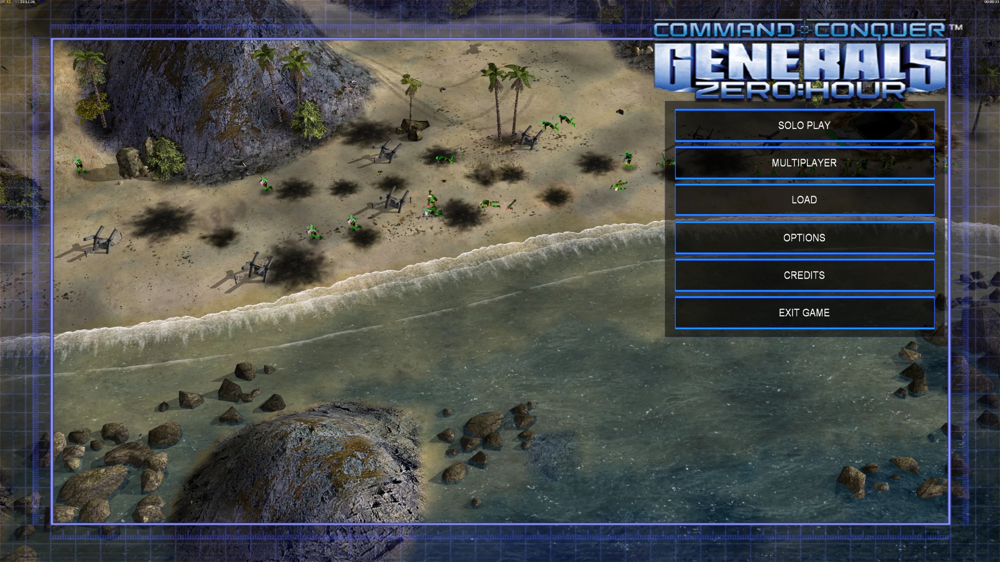
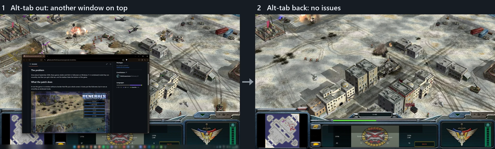
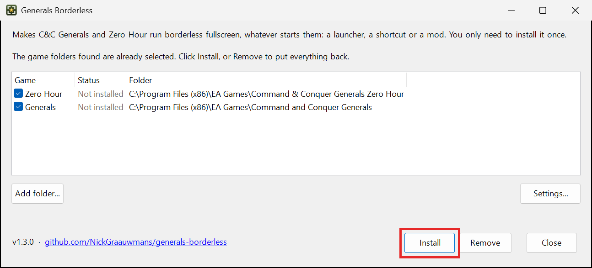
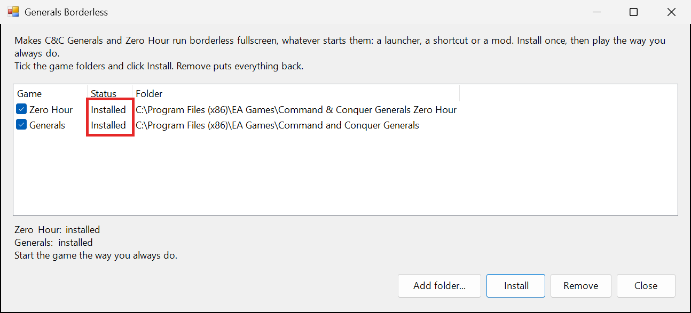
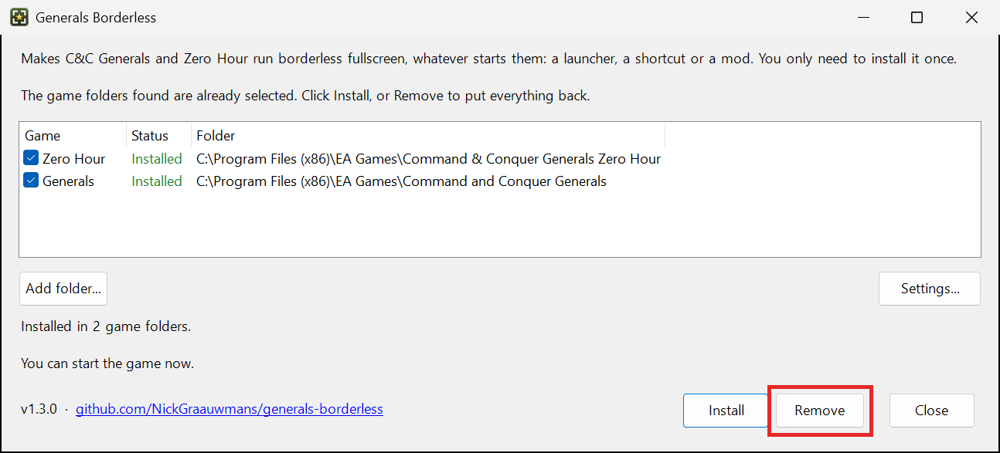

# Generals Borderless

Fixes the stutter and hitching in **C&C Generals** and **Zero Hour** on Windows 11. Works with **ShockWave** and other mods too.

## The problem

Since about September 2026, these games stutter and hitch in fullscreen on Windows 11. In windowed mode they run smoothly, but then you get a title bar, and the taskbar hides the bottom of the game.

## What the patch does

It runs the game in a window without a border that fills your whole screen. It looks just like fullscreen, but it runs as smoothly as windowed mode.

You install it once. After that the game always starts this way, no matter how you start it: the ShockWave launcher, a shortcut, GenPatcher or another mod.

**Bonus:** alt-tab no longer crashes the game, which often happens in fullscreen.

It is also nice if you simply like borderless fullscreen: alt-tab is quick, a second monitor works normally, and the mouse stays inside the game, so scrolling at the edge of the screen still works.

## Install

1. Download `GeneralsBorderless.zip` from [Releases](../../releases/latest) and unzip it.
2. Run `GeneralsBorderless.exe`. Click **Yes** when Windows asks for admin rights (the game is in Program Files).
3. It shows the game folders it found, already selected. Click **Install**.
   Is your game not in the list? Click **Add folder...** and pick your game folder. A folder that holds both Generals and Zero Hour works too.

   

4. The folders now say **Installed**. Close it and start the game.

   

Windows may say the app is unknown, because it isn't signed. Click **More info**, then **Run anyway**. If your antivirus removes `dinput8.dll`, allow it.

## Remove

Run `GeneralsBorderless.exe` again and click **Remove** (it works on the selected folders). Your game is back to how it was.

## Update

When a new version is out, the patcher tells you at the bottom left of its window. Download the new version, run its `GeneralsBorderless.exe` and click **Install**. Folders with the old version say "Installed, older version".

## How it works

The patch puts a small file, `dinput8.dll`, in the game folder. The game loads this file by itself every time it starts. That is why it doesn't matter which launcher or mod starts the game.

When the game starts, the patch:

1. tells the game to start in windowed mode, because windowed mode doesn't stutter;
2. removes the border and title bar of the window;
3. makes the window exactly as big as your screen, and sets the game to your screen's resolution;
4. stops Windows display scaling (125%, 150%) from making the game too big;
5. keeps the mouse inside the game while you play.

For everything else the game asks this file for, the patch passes the request on to the real `dinput8.dll` from Windows (it handles the keyboard). Your game files stay the same, so you can still play LAN games with people who don't have the patch.

Did the game folder already have a `dinput8.dll` from another tool? Then the patch keeps it as `dinput8_original.dll` and still uses it. **Remove** puts it back.

## Settings

Run `GeneralsBorderless.exe` and click **Settings...** (it works on the selected folders). The changes take effect the next time the game starts. The settings are stored in `GeneralsBorderless.ini` in the game folder:

| Setting | What it does |
| --- | --- |
| `Enabled=0` | Turns the patch off without removing it. The game starts like before. |
| `ForceNativeResolution=0` | Lets you pick your own resolution in the game's options. A lower resolution is scaled up to fill the screen, so the menus and buttons get bigger. If its shape differs from your screen (like 4:3), you get black bars on the sides instead of a stretched picture. |
| `ScaleToScreen=0` | Together with `ForceNativeResolution=0`: shows a lower resolution at its own size in the middle of the screen instead of scaling it up (box mode). |
| `LockCursor=0` | Lets the mouse leave the game window. |

## Problems?

- It stopped working after you ran GenPatcher? Run `GeneralsBorderless.exe` and click **Install** again.
- WorldBuilder isn't affected.
- Logs are in `%LOCALAPPDATA%\GeneralsBorderless`: `game.log` for the game, `patcher.log` for install and remove.
- For scripts: `GeneralsBorderless.exe -install | -remove | -status [-path <game folder>]`
